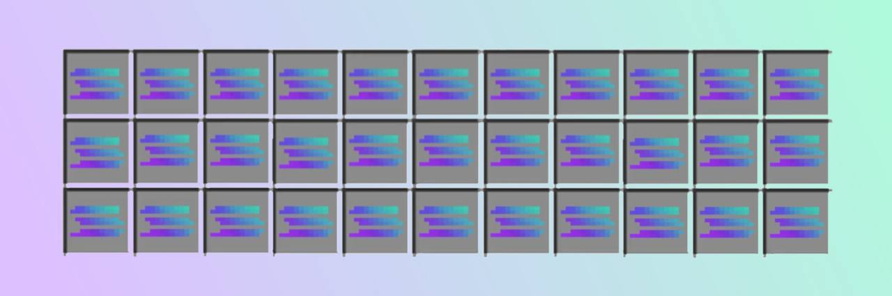

  
  
  # Token Spawner
  
  **The Airdrop the Trenches Need**
  
  Powered by Helius Sender
  
  

---

## What This Is

Mass airdrops to millions of wallets. What used to take days and drain wallets in fees now happens in minutes.

We're returning 100% of Pump Fun creator fees to the wallets that actually trade. No governance tokens. No DAO votes. No complicated claim process. Just direct deposits to everyone who traded on Pump Fun in the last 3 months.

## The Problem We Solve

Traditional airdrops are broken:
- Take days to complete
- Cost thousands in transaction fees
- Often exclude active users
- Require complicated claim processes

## Our Approach

**Direct. Fast. Fair.**

- Airdrop to millions of wallets in under an hour
- 15 recipients per transaction
- 1,000 transactions processed concurrently
- Automatic retry logic
- Sub-penny transaction costs

## How It Works

1. Collect Pump Fun creator trading fees
2. Snapshot every wallet that traded in the last 90 days
3. Split fees equally across all wallets
4. Send SOL directly using Helius Sender

No claims. No wait times. No bullshit.

## The Stack

**Helius Sender** - Ultra-low latency transaction submission with SWQOS priority  
**Helius RPC** - High-performance Solana infrastructure  
**Solana Web3.js** - Native Solana integration  

Traditional airdrops send one transaction at a time. We send thousands simultaneously. That's the difference.

## Performance

- 270,000+ wallets processed
- Sub-second transaction confirmation
- 99.9%+ success rate
- Zero manual intervention required

## Follow Us

**X**: [@tokenspawner](https://x.com/tokenspawner)

---

*Returning value to the people who create it.*
