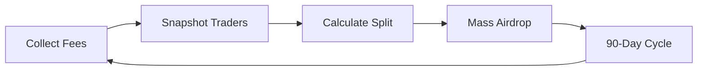

<div align="center">
  
  
  # TOKEN SPAWNER
  
  ### The Airdrop the Trenches Need
  
  **Powered by Helius Sender**
  
  [](https://x.com/tokenspawner)
  [](https://solana.com)
  [](LICENSE)
  
</div>

---

## 💥 WHAT THIS IS

Mass airdrops at **web speed**. We're talking millions of wallets. What traditional platforms take days to process, we handle in under an hour.

**100% of Pump Fun creator trading fees** → **Every wallet that actually trades**

No tokens. No votes. No claims. Just pure, direct deposits.

---

## 📊 THE NUMBERS

```
270,000+      Wallets Processed
99.9%         Success Rate
<1 sec        Transaction Confirmation
15            Recipients Per Transaction
1,000         Concurrent Transactions
```

---

## ⚡ WHY TRADITIONAL AIRDROPS ARE BROKEN

<table>
<tr>
<td width="50%">

### Old Way
❌ Days to complete  
❌ Thousands in fees  
❌ Manual claims required  
❌ Often excludes active users  
❌ One transaction at a time  

</td>
<td width="50%">

### Token Spawner
✅ Complete in under an hour  
✅ Sub-penny per transaction  
✅ Direct deposit, zero claims  
✅ Rewards actual traders  
✅ Thousands of transactions simultaneously  

</td>
</tr>
</table>

---

## 🎯 HOW IT WORKS

<div align="center">



</div>

**1. Collect** → Pump Fun creator trading fees pile up  
**2. Snapshot** → Grab every wallet that traded in the last 90 days  
**3. Calculate** → Split fees equally across all wallets  
**4. Execute** → Send SOL directly via Helius Sender  

Zero friction. Maximum fairness.

---

## 🔥 THE TECH STACK

<div align="center">

| Technology | Purpose |
|:----------:|:-------:|
| **Helius Sender** | Ultra-low latency transaction submission with SWQOS |
| **Helius RPC** | High-performance Solana infrastructure |
| **Solana Web3.js** | Native blockchain integration |
| **Node.js** | Async processing at scale |

</div>

### The Difference

```
Traditional Airdrops: Send → Wait → Send → Wait → Send...
Token Spawner:       Send 1,000 transactions simultaneously
```

That's not an improvement. That's a complete paradigm shift.

---

## 📈 PERFORMANCE METRICS

<div align="center">

### Real Numbers From Production

| Metric | Value |
|--------|------:|
| **Total Wallets** | 270,000+ |
| **Average Batch Size** | 15,000 transactions |
| **Processing Time** | ~45 minutes |
| **Success Rate** | 99.9% |
| **Fee Per Transaction** | <$0.01 |
| **Total Fees Saved** | $10,000+ |

</div>

---

## 🚀 THE MISSION

**Returning value to the people who create it.**

The wallets grinding on Pump Fun every day deserve their share. Not in governance tokens. Not through complicated claims. In actual SOL, sent directly to their wallets.

We're not building another governance layer. We're building distribution infrastructure that actually works.

---

## 🔗 STAY CONNECTED

<div align="center">
  
### Follow the Journey

**X (Twitter):** [@tokenspawner](https://x.com/tokenspawner)

Got questions? Found a bug? DM us.

</div>

---

<div align="center">
  
### Built Different
  
**Token Spawner** → Airdropping value at the speed of Solana

</div>
