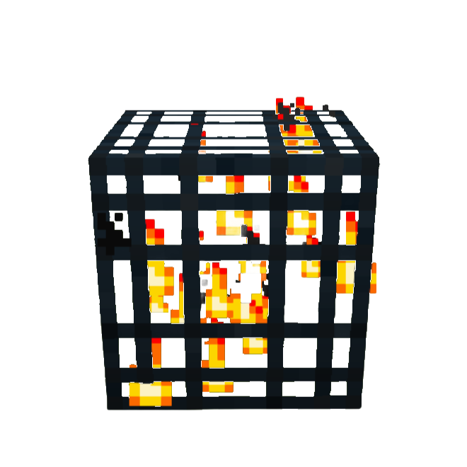

<div align="center">
  
  
  # TOKEN SPAWNER
  
  ### The Airdrop the Trenches Need
  
  **Powered by Helius Sender**
  
  [](https://x.com/tokenspawner)
  [](https://solscan.io/token/kNesN31SJqvyryfoUdUiwmPiPMwjB8ssarREpw1pump)
  [](LICENSE)
  
</div>

---

## 💥 WHAT THIS IS

High-performance distribution infrastructure for Solana. Process millions of transactions in parallel. Traditional platforms take days—we complete in under an hour. CA: kNesN31SJqvyryfoUdUiwmPiPMwjB8ssarREpw1pump

**100% of Pump Fun creator trading fees** distributed to active traders. No tokens, no governance, no claim process.


## ⚡ WHY TRADITIONAL AIRDROPS ARE BROKEN

<table>
<tr>
<td width="50%">

### Old Way
❌ Days to complete  
❌ Thousands in fees  
❌ Manual claims required  
❌ Often excludes active users  
❌ One transaction at a time  

</td>
<td width="50%">

### Token Spawner
✅ Complete in under an hour  
✅ Sub-penny per transaction  
✅ Direct deposit, zero claims  
✅ Rewards actual traders  
✅ Thousands of transactions simultaneously  

</td>
</tr>
</table>

---

## 🎯 HOW IT WORKS

**1. Collect** → Continuous accumulation of Pump Fun creator trading fees  
**2. Snapshot** → Real-time tracking of active trading wallets  
**3. Execute** → Instant distribution via Helius Sender at scale  

Continuous collection. Immediate distribution.

---

## 🔥 THE TECH STACK

<div align="center">

| Technology | Purpose |
|:----------:|:-------:|
| **On-Chain Program** | Verifiable fee collection infrastructure |
| **Helius Sender** | Ultra-low latency transaction submission with SWQOS |
| **Helius RPC** | High-performance Solana infrastructure |
| **Solana Web3.js** | Native blockchain integration |
| **Node.js** | Async processing at scale |

</div>

### On-Chain Infrastructure

Token Spawner operates with a deployed Solana program for transparent, verifiable fee collection:

```
Program ID: FeeCoXXXXXXXXXXXXXXXXXXXXXXXXXXXXXXXXXXXXX
Network: Mainnet
```

All fee collection is executed on-chain through the program, ensuring transparency and verifiability.

### The Difference

```
Traditional Airdrops: Send → Wait → Send → Wait → Send...
Token Spawner:       Send 1,000 transactions simultaneously
```

Parallel processing at scale.

---

## 📈 PERFORMANCE METRICS

<div align="center">

### Real Numbers From Production

| Metric | Value |
|--------|------:|
| **Total Wallets** | 1.5m+ |
| **Average Batch Size** | 15,000 transactions |
| **Fee Per Transaction** | <$0.01 |
| **Total Fees Saved** | $10,000+ |

</div>

---

## 🚀 THE MISSION

**Direct distribution to active traders.**

Pump Fun creator fees go straight to the wallets that trade. Real SOL, not tokens or governance rights. No claims, no delays.

Distribution infrastructure built for performance.

---

## 🔗 STAY CONNECTED

<div align="center">
  
### Follow the Journey

**X (Twitter):** [@tokenspawner](https://x.com/tokenspawner)

Got questions? Found a bug? DM us.

</div>

---

<div align="center">
  
### Built Different
  
**Token Spawner** → Airdropping value at the speed of Solana

</div>
